# BTD-Erlang Distributed Game Architecture

```mermaid
graph TB
    %% ===== PHYSICAL ARCHITECTURE =====
    subgraph "Main Node (132.72.81.60)"
        MainApp[Application<br/>main_supervisor]
        MainSuper[Main Supervisor]
        MainServer[Main Server<br/>gen_server]
        GUI[GUI<br/>wxErlang]
        MnesiaMain[(Mnesia Database<br/>Disc Copies)]
        
        MainApp --> MainSuper
        MainSuper --> MainServer
        MainServer <--> GUI
        MainServer <--> MnesiaMain
    end
    
    subgraph "Worker Node 1 (132.72.81.167)"
        Worker1Sup[Worker Supervisor<br/>Region 0]
        Region1[Region Server 0<br/>gen_server]
        MnesiaW1[(Mnesia<br/>RAM Copy)]
        
        Worker1Sup --> Region1
        Region1 <--> MnesiaW1
    end
    
    subgraph "Worker Node 2 (132.72.81.85)"
        Worker2Sup[Worker Supervisor<br/>Region 1]
        Region2[Region Server 1<br/>gen_server]
        MnesiaW2[(Mnesia<br/>RAM Copy)]
        
        Worker2Sup --> Region2
        Region2 <--> MnesiaW2
    end
    
    subgraph "Worker Node 3 (132.72.80.185)"
        Worker3Sup[Worker Supervisor<br/>Region 2]
        Region3[Region Server 2<br/>gen_server]
        MnesiaW3[(Mnesia<br/>RAM Copy)]
        
        Worker3Sup --> Region3
        Region3 <--> MnesiaW3
    end
    
    subgraph "Worker Node 4 (132.72.81.224)"
        Worker4Sup[Worker Supervisor<br/>Region 3]
        Region4[Region Server 3<br/>gen_server]
        MnesiaW4[(Mnesia<br/>RAM Copy)]
        
        Worker4Sup --> Region4
        Region4 <--> MnesiaW4
    end
    
    %% ===== GAME OBJECTS (Dynamic Processes) =====
    subgraph "Game Objects (Spawned Dynamically)"
        subgraph "Region 0 Objects"
            Bloon1[Bloon FSM<br/>gen_statem]
            Monkey1[Monkey FSM<br/>gen_statem]
            Arrow1[Arrow FSM<br/>gen_statem]
        end
        
        subgraph "Region 1 Objects"
            Bloon2[Bloon FSM<br/>gen_statem]
            Monkey2[Monkey FSM<br/>gen_statem]
            Arrow2[Arrow FSM<br/>gen_statem]
        end
        
        subgraph "Region 2 Objects"
            Bloon3[Bloon FSM<br/>gen_statem]
            Monkey3[Monkey FSM<br/>gen_statem]
            Arrow3[Arrow FSM<br/>gen_statem]
        end
        
        subgraph "Region 3 Objects"
            Bloon4[Bloon FSM<br/>gen_statem]
            Monkey4[Monkey FSM<br/>gen_statem]
            Arrow4[Arrow FSM<br/>gen_statem]
        end
    end
    
    %% ===== CONNECTIONS =====
    %% Main Server to Regions
    MainServer -.->|"Spawn Commands<br/>Cost Validation"| Region1
    MainServer -.->|"Spawn Commands<br/>Cost Validation"| Region2
    MainServer -.->|"Spawn Commands<br/>Cost Validation"| Region3
    MainServer -.->|"Spawn Commands<br/>Cost Validation"| Region4
    
    %% Regions to Main Server
    Region1 -.->|"Game Over<br/>Banana Rewards"| MainServer
    Region2 -.->|"Game Over<br/>Banana Rewards"| MainServer
    Region3 -.->|"Game Over<br/>Banana Rewards"| MainServer
    Region4 -.->|"Game Over<br/>Banana Rewards"| MainServer
    
    %% Regions spawn game objects
    Region1 --> Bloon1
    Region1 --> Monkey1
    Region1 --> Arrow1
    
    Region2 --> Bloon2
    Region2 --> Monkey2
    Region2 --> Arrow2
    
    Region3 --> Bloon3
    Region3 --> Monkey3
    Region3 --> Arrow3
    
    Region4 --> Bloon4
    Region4 --> Monkey4
    Region4 --> Arrow4
    
    %% Game Object Interactions
    Monkey1 -.->|"Target Finding"| Bloon1
    Monkey1 -.->|"Spawn Arrow"| Arrow1
    Arrow1 -.->|"Hit Damage"| Bloon1
    
    Monkey2 -.->|"Target Finding"| Bloon2
    Monkey2 -.->|"Spawn Arrow"| Arrow2
    Arrow2 -.->|"Hit Damage"| Bloon2
    
    Monkey3 -.->|"Target Finding"| Bloon3
    Monkey3 -.->|"Spawn Arrow"| Arrow3
    Arrow3 -.->|"Hit Damage"| Bloon3
    
    Monkey4 -.->|"Target Finding"| Bloon4
    Monkey4 -.->|"Spawn Arrow"| Arrow4
    Arrow4 -.->|"Hit Damage"| Bloon4
    
    %% Balloon Migration (Cross-Region)
    Bloon1 -.->|"Migration"| Bloon2
    Bloon2 -.->|"Migration"| Bloon3
    Bloon3 -.->|"Migration"| Bloon4
    
    %% Mnesia Replication
    MnesiaMain <==>|"Replication"| MnesiaW1
    MnesiaMain <==>|"Replication"| MnesiaW2
    MnesiaMain <==>|"Replication"| MnesiaW3
    MnesiaMain <==>|"Replication"| MnesiaW4
    
    %% Global Registry
    subgraph "Global Services"
        GlobalReg[Global Registry<br/>Process Discovery]
    end
    
    MainServer <--> GlobalReg
    Region1 <--> GlobalReg
    Region2 <--> GlobalReg
    Region3 <--> GlobalReg
    Region4 <--> GlobalReg
    Bloon1 <--> GlobalReg
    Bloon2 <--> GlobalReg
    Bloon3 <--> GlobalReg
    Bloon4 <--> GlobalReg
    
    %% Styling
    classDef supervisor fill:#ffeb3b,stroke:#333,stroke-width:2px
    classDef server fill:#4caf50,stroke:#333,stroke-width:2px
    classDef fsm fill:#2196f3,stroke:#333,stroke-width:2px
    classDef gui fill:#ff9800,stroke:#333,stroke-width:2px
    classDef database fill:#9c27b0,stroke:#333,stroke-width:2px
    classDef service fill:#607d8b,stroke:#333,stroke-width:2px
    
    class MainApp,MainSuper,Worker1Sup,Worker2Sup,Worker3Sup,Worker4Sup supervisor
    class MainServer,Region1,Region2,Region3,Region4 server
    class Bloon1,Bloon2,Bloon3,Bloon4,Monkey1,Monkey2,Monkey3,Monkey4,Arrow1,Arrow2,Arrow3,Arrow4 fsm
    class GUI gui
    class MnesiaMain,MnesiaW1,MnesiaW2,MnesiaW3,MnesiaW4 database
    class GlobalReg service
```

## Key Architecture Components

### 1. **Supervision Tree**
- **Main Supervisor**: Supervises the main server
- **Worker Supervisors**: One per worker node, manages region servers
- **Fault Tolerance**: Automatic restart of failed components

### 2. **Distributed Nodes**
- **Main Node**: Hosts GUI, main server, and disc-based Mnesia
- **4 Worker Nodes**: Each manages one game region (0-3)
- **Region Width**: 200 pixels per region (800px total map)

### 3. **Core Servers**
- **Main Server**: Central coordinator, banana economy, global game state
- **Region Servers**: Manage game objects in their geographic region
- **GUI**: wxErlang-based user interface with 30 FPS updates

### 4. **Game Objects (FSMs)**
- **Bloons**: Move along path, can migrate between regions/nodes
- **Monkeys**: Attack bloons within range, spawn arrows
- **Arrows**: Fly toward targets, deal damage on impact

### 5. **Database Layer**
- **Mnesia**: Distributed database with disc copies on main node
- **Tables**: bloons, monkeys, darts (arrows)
- **Replication**: RAM copies on worker nodes for performance

### 6. **Communication Patterns**
- **Global Registry**: Process discovery across nodes
- **Message Passing**: Async casts for performance
- **Cross-Region**: Balloon migration and targeting

### 7. **Economic System**
- **Banana Currency**: 1000 initial, earned from destroying bloons
- **Monkey Costs**: Ground(100), Water(150), Fire(200), Air(250), Avatar(500)
- **Reward Formula**: 5 + (Original Health × 2) bananas per kill

### 8. **Game Flow**
1. Player places monkeys (cost validation)
2. Balloons spawn and move along path
3. Monkeys detect and attack balloons
4. Balloons migrate between regions as they move
5. Destroyed balloons award bananas
6. Game over when balloon reaches end
7. Restart clears all processes and database

### 9. **Fault Tolerance Features**
- **Process Isolation**: Failure of one game object doesn't affect others
- **Supervisor Restart**: Automatic recovery of critical components
- **Database Consistency**: ACID properties via Mnesia transactions
- **Global Registration**: Process discovery survives node failures

### 10. **Performance Optimizations**
- **Regional Distribution**: Load balanced across 4 nodes
- **Batch GUI Updates**: 30 FPS instead of per-object updates
- **Database Caching**: RAM copies on worker nodes
- **Message Batching**: Combined database queries for GUI updates
