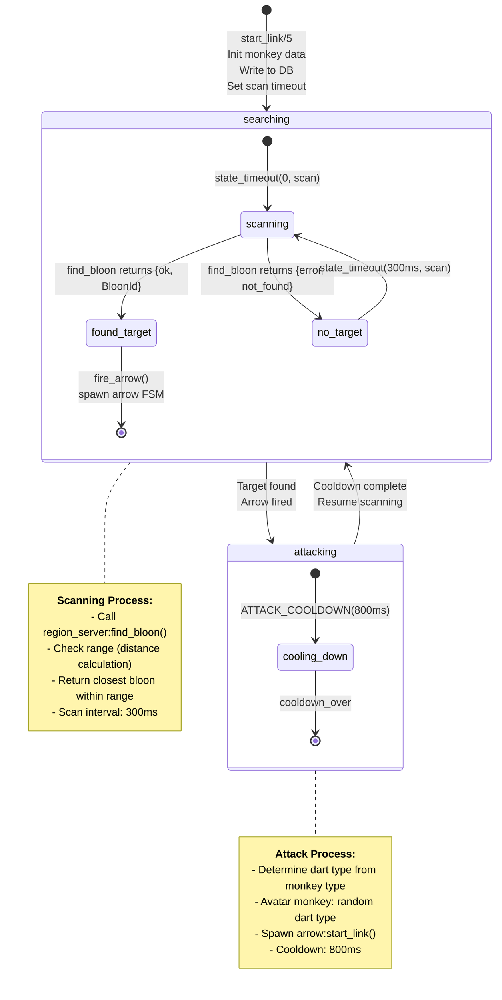
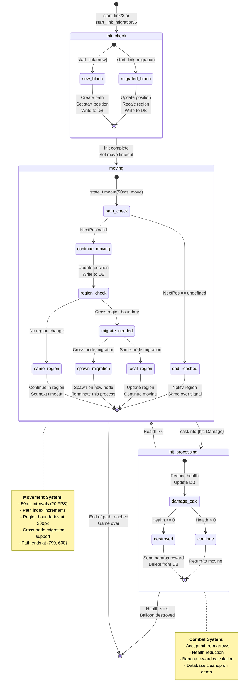
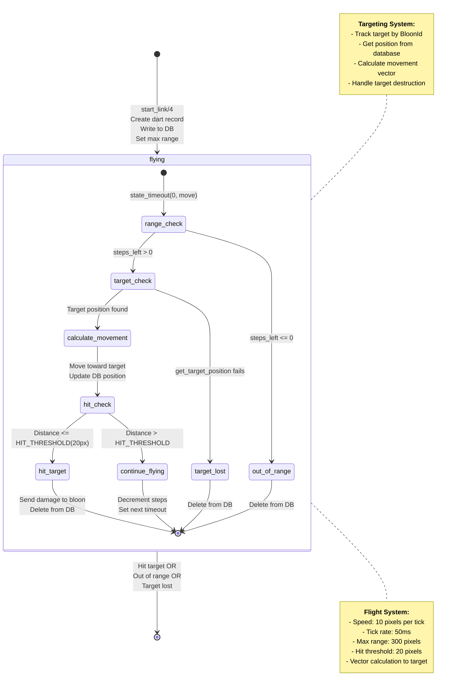
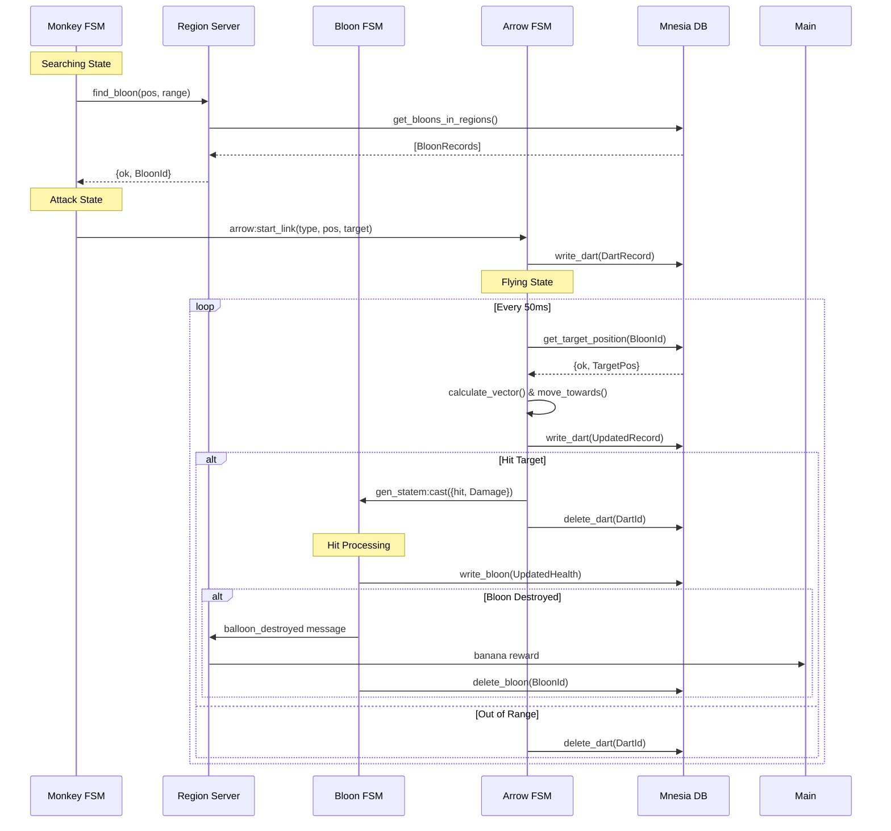

# FSM Architecture Diagrams - BTD-Erlang Game Objects

## 1. Monkey FSM Architecture



### Monkey FSM Details

**States:**
- **searching**: Default state, continuously scans for targets
- **attacking**: Cooldown period after firing an arrow

**Data Structure:**
```erlang
-record(data, {type, pos, range, region_pid}).
```

**Key Features:**
- **Target Acquisition**: Uses region server to find bloons in range
- **Dart Type Mapping**: Different monkey types shoot different darts
- **Avatar Special**: Shoots random dart types
- **Performance**: 300ms scan interval, 800ms attack cooldown

---

## 2. Bloon (Balloon) FSM Architecture



### Bloon FSM Details

**States:**
- **moving**: Primary state, handles movement and migration
- **hit_processing**: Temporary state for damage calculation

**Data Structure:**
```erlang
-record(state, {id, index, health, pos, current_region_pid, region_pids, region_id}).
```

**Key Features:**
- **Path Movement**: Follows predefined path with 50ms intervals
- **Cross-Node Migration**: Seamless migration between worker nodes
- **Health System**: Takes damage, awards bananas on destruction
- **Global Registration**: Discoverable across distributed system

---

## 3. Arrow (Dart) FSM Architecture



### Arrow FSM Details

**States:**
- **flying**: Only state, handles movement and collision detection

**Data Structure:**
```erlang
-record(data, {id, type, pos, target_id, region_id, steps_left}).
```

**Key Features:**
- **Projectile Physics**: Vector-based movement toward target
- **Range Limitation**: Maximum 300 pixels (30 steps at 10px/step)
- **Hit Detection**: 20 pixel threshold for collision
- **Target Tracking**: Follows moving bloons using database lookups

---

## FSM Communication Patterns



## Performance Characteristics

| FSM Type | State Duration | Update Frequency | DB Operations |
|----------|---------------|------------------|---------------|
| **Monkey** | searching: continuous<br/>attacking: 800ms | scan: 300ms<br/>attack: on target | write_monkey (init)<br/>No updates during operation |
| **Bloon** | moving: continuous | movement: 50ms | write_bloon (every move)<br/>delete_bloon (on death) |
| **Arrow** | flying: ~1.5s avg | movement: 50ms | write_dart (every move)<br/>delete_dart (on hit/expire) |

## Memory & Process Management

- **Process Lifecycle**: All FSMs are temporary processes
- **Cleanup**: Automatic on process termination
- **Global Registry**: Only bloons are globally registered
- **Local Registry**: Monkeys and arrows are not registered
- **Supervision**: No direct supervision (fail-fast design)
- **Database Consistency**: ACID transactions ensure state consistency
