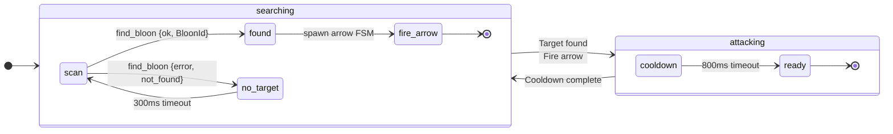
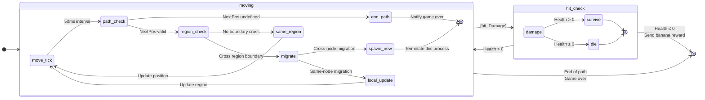
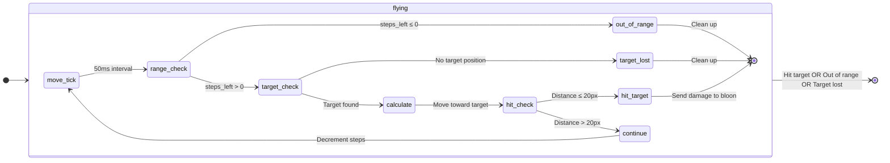
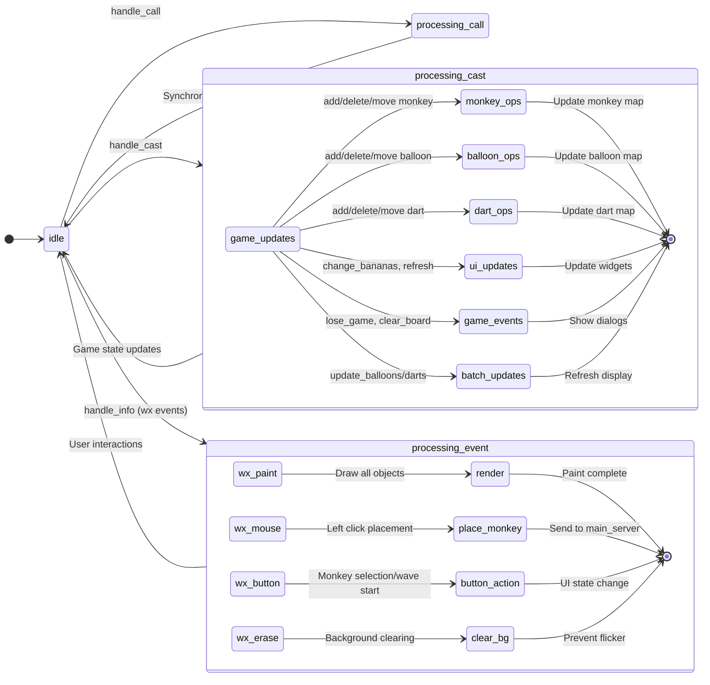
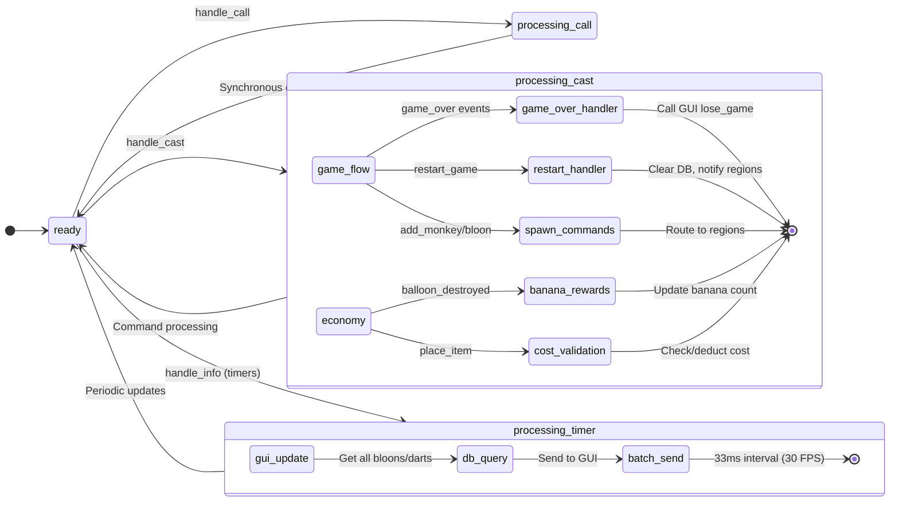
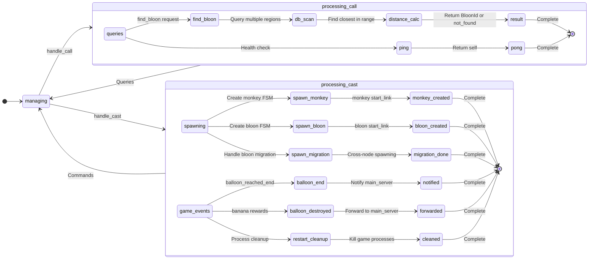

# FSM Architecture Diagrams - BTD-Erlang Game Objects

> **Note:** To view these diagrams as images instead of code, paste the mermaid code into:
> - [Mermaid Live Editor](https://mermaid.live) 
> - GitHub (when viewing .md files)
> - VS Code with Mermaid extension
> - Or any Mermaid-compatible viewer

---

## 1. Monkey FSM Architecture



**Monkey Data:** `{type, pos, range, region_pid}` | **Scan:** 300ms | **Cooldown:** 800ms

---

## 2. Bloon (Balloon) FSM Architecture



**Bloon Data:** `{id, index, health, pos, current_region_pid, region_pids, region_id}` | **Move:** 50ms | **Migration:** Cross-node support

---

## 3. Arrow (Dart) FSM Architecture



**Arrow Data:** `{id, type, pos, target_id, region_id, steps_left}` | **Speed:** 10px/tick | **Range:** 300px | **Hit:** 20px threshold

---

# Gen_Server Architecture Diagrams

## 4. GUI Gen_Server Architecture



**GUI State:** `{frame, board, bitmaps, monkeys, balloons, darts, placing, banana_text_widget, button_ids}` 

**Key Operations:** Rendering (paint), User input (mouse/buttons), Game state display, wxErlang event handling

## 5. Main_Server Gen_Server Architecture



**Main_Server State:** `{region_pids, game_over, bananas}` | **Economy:** Banana costs/rewards | **Coordination:** Cross-region management

## 6. Region_Server Gen_Server Architecture



**Region_Server State:** `{id, total_regions}` | **Responsibilities:** Local game object management, Cross-region queries, Process spawning

---

## FSM Communication Overview

```mermaid
flowchart LR
    M[Monkey FSM] -->|find_bloon| R[Region Server]
    R -->|{ok, BloonId}| M
    M -->|spawn| A[Arrow FSM]
    A -->|{hit, Damage}| B[Bloon FSM]
    B -->|banana_reward| R
    R -->|banana_reward| MS[Main Server]
    MS -->|update| GUI[GUI]
    
    subgraph "Database"
        DB[(Mnesia)]
    end
    
    M -.->|write_monkey| DB
    B -.->|write/delete_bloon| DB
    A -.->|write/delete_dart| DB
    R -.->|read queries| DB
```

## Gen_Server Communication & Message Flow

```mermaid
flowchart LR
    subgraph "User Interaction"
        User[Player] -->|Click/Button| GUI
    end
    
    subgraph "Main Node"
        GUI[GUI Server] 
        MS[Main Server]
    end
    
    subgraph "Worker Nodes"
        R1[Region 0]
        R2[Region 1] 
        R3[Region 2]
        R4[Region 3]
    end
    
    subgraph "Game Objects"
        M[Monkey FSMs]
        B[Bloon FSMs]
        A[Arrow FSMs]
    end
    
    %% User to GUI
    GUI -->|place_item| MS
    GUI <--|change_bananas| MS
    GUI <--|lose_game| MS
    
    %% Main Server to Regions
    MS -->|spawn_monkey/bloon| R1
    MS -->|spawn_monkey/bloon| R2
    MS -->|spawn_monkey/bloon| R3
    MS -->|spawn_monkey/bloon| R4
    MS -->|restart_cleanup| R1
    MS -->|restart_cleanup| R2
    MS -->|restart_cleanup| R3
    MS -->|restart_cleanup| R4
    
    %% Regions to Main Server  
    R1 -->|game_over/banana_reward| MS
    R2 -->|game_over/banana_reward| MS
    R3 -->|game_over/banana_reward| MS
    R4 -->|game_over/banana_reward| MS
    
    %% Regions spawn Game Objects
    R1 --> M
    R1 --> B
    R2 --> M
    R2 --> B
    R3 --> M
    R3 --> B
    R4 --> M
    R4 --> B
    
    %% Game Object Interactions
    M -->|find_bloon| R1
    M -->|spawn arrow| A
    A -->|hit damage| B
    B -->|destruction reward| R1
    
    %% GUI Updates
    MS -->|update_balloons/darts| GUI
    MS -.->|33ms timer| MS
```

## Message Types & Frequencies

| **Server** | **Message Type** | **Frequency** | **Source/Target** | **Purpose** |
|------------|------------------|---------------|-------------------|-------------|
| **GUI** | `{add_monkey, T,X,Y,I}` | On placement | User → GUI | Add monkey to display |
| **GUI** | `{update_balloons, Map}` | 30 FPS | Main → GUI | Batch balloon updates |
| **GUI** | `{change_bananas, Amount}` | On economy change | Main → GUI | Update banana display |
| **GUI** | `#wx{event=#wxPaint{}}` | On refresh | wxErlang → GUI | Redraw game board |
| **Main** | `{place_item, {MT,X,Y}}` | On placement | GUI → Main | Validate & spawn monkey |
| **Main** | `{balloon_destroyed, Id, Health}` | On death | Region → Main | Award bananas |
| **Main** | `{game_over, BloonId}` | On path end | Region → Main | Trigger lose condition |
| **Main** | `update_gui_balloons` | 33ms timer | Timer → Main | Periodic GUI updates |
| **Region** | `{find_bloon, Pos, Range}` | 300ms | Monkey → Region | Target acquisition |
| **Region** | `{spawn_monkey, Type, Pos, Range}` | On placement | Main → Region | Create monkey FSM |
| **Region** | `{spawn_bloon, Health, Pids, RegionId}` | On wave start | Main → Region | Create bloon FSM |

## State Management & Persistence

| **Server** | **State Persistence** | **Cleanup Strategy** | **Fault Tolerance** |
|------------|-----------------------|----------------------|---------------------|
| **GUI** | In-memory maps | Automatic on restart | Restart on crash |
| **Main** | Banana count, region PIDs | Database clear + process kill | Supervisor restart |
| **Region** | Region ID only | Process enumeration & kill | Supervisor restart |

**Database Role:** Central state store for all game objects, cross-node replication, ACID transactions
