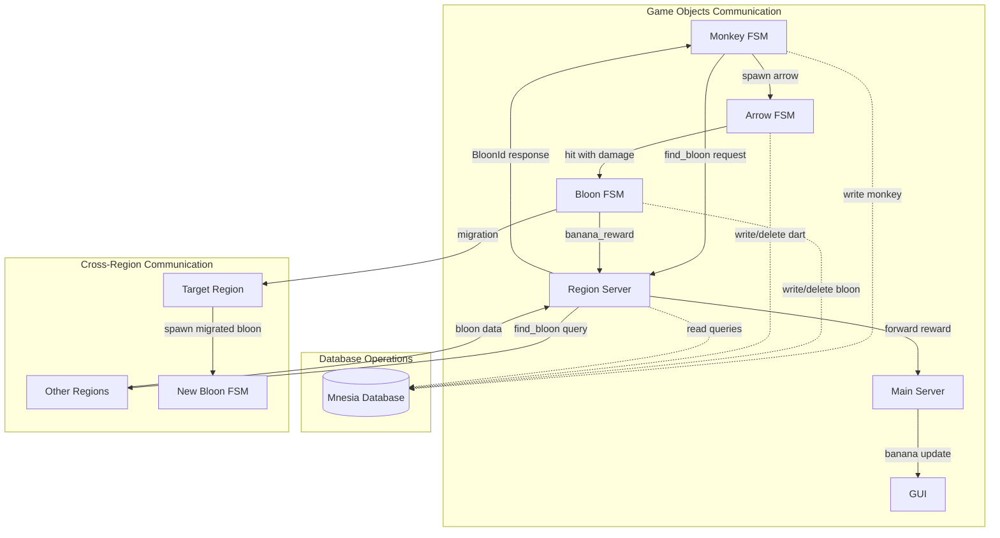
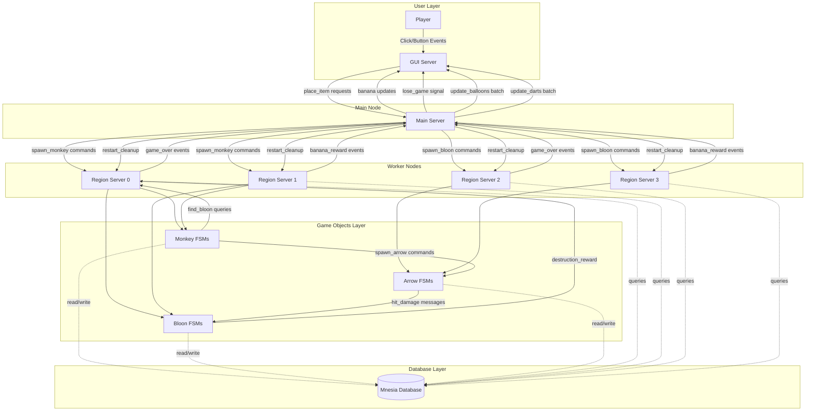
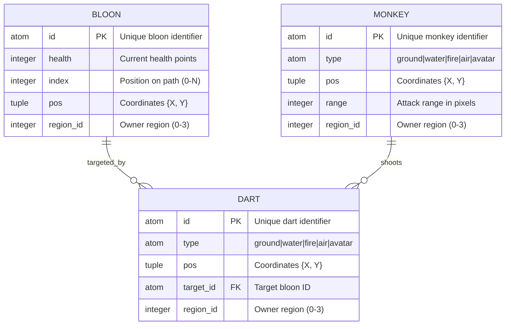
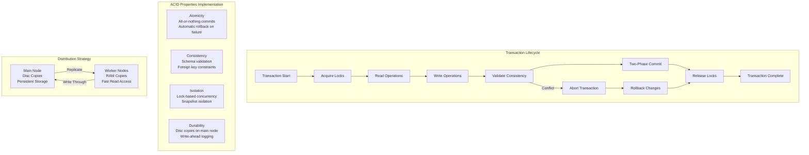
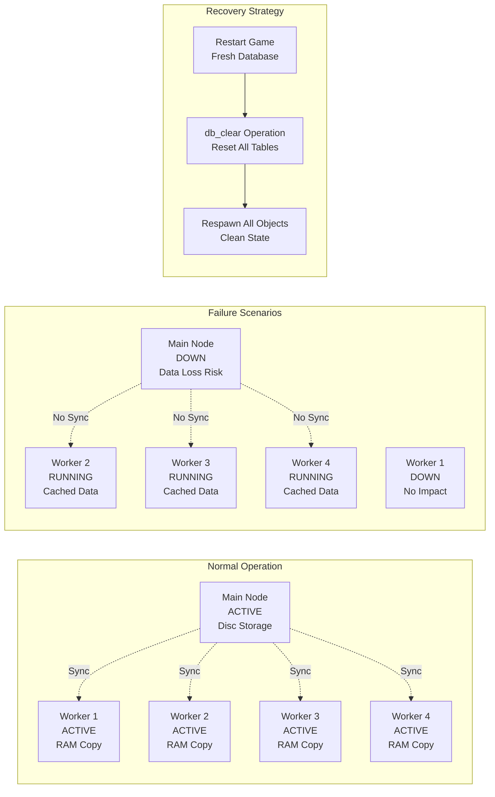
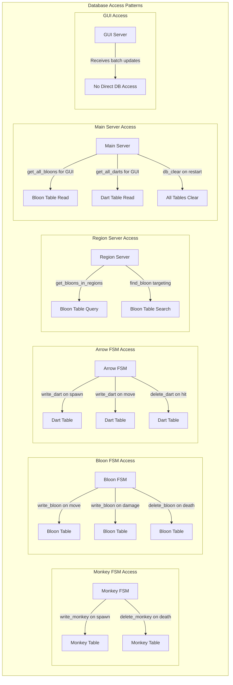

# FSM Architecture Diagrams - BTD-Erlang Game Objects

> **Note:** To view these diagrams as images instead of code, paste the mermaid code into:
> - [Mermaid Live Editor](https://mermaid.live) 
> - GitHub (when viewing .md files)
> - VS Code with Mermaid extension
> - Or any Mermaid-compatible viewer

---

## 1. Monkey FSM Architecture

**Monkey Data:** `{type, pos, range, region_pid}` | **Scan:** 300ms | **Cooldown:** 800ms

---

## 2. Bloon (Balloon) FSM Architecture

**Bloon Data:** `{id, index, health, pos, current_region_pid, region_pids, region_id}` | **Move:** 50ms | **Migration:** Cross-node support

---

## 3. Arrow (Dart) FSM Architecture

**Arrow Data:** `{id, type, pos, target_id, region_id, steps_left}` | **Speed:** 10px/tick | **Range:** 300px | **Hit:** 20px threshold

---

# Gen_Server Architecture Diagrams

## 4. GUI Gen_Server Architecture

**GUI State:** `{frame, board, bitmaps, monkeys, balloons, darts, placing, banana_text_widget, button_ids}` 

**Key Operations:** Rendering (paint), User input (mouse/buttons), Game state display, wxErlang event handling

## 5. Main_Server Gen_Server Architecture

**Main_Server State:** `{region_pids, game_over, bananas}` | **Economy:** Banana costs/rewards | **Coordination:** Cross-region management

## 6. Region_Server Gen_Server Architecture

**Region_Server State:** `{id, total_regions}` | **Responsibilities:** Local game object management, Cross-region queries, Process spawning

---

## FSM Communication Overview

## Gen_Server Communication & Message Flow

## Message Types & Frequencies

| **Server** | **Message Type** | **Frequency** | **Source/Target** | **Purpose** |
|------------|------------------|---------------|-------------------|-------------|
| **GUI** | `{add_monkey, T,X,Y,I}` | On placement | User → GUI | Add monkey to display |
| **GUI** | `{update_balloons, Map}` | 30 FPS | Main → GUI | Batch balloon updates |
| **GUI** | `{change_bananas, Amount}` | On economy change | Main → GUI | Update banana display |
| **GUI** | `#wx{event=#wxPaint{}}` | On refresh | wxErlang → GUI | Redraw game board |
| **Main** | `{place_item, {MT,X,Y}}` | On placement | GUI → Main | Validate & spawn monkey |
| **Main** | `{balloon_destroyed, Id, Health}` | On death | Region → Main | Award bananas |
| **Main** | `{game_over, BloonId}` | On path end | Region → Main | Trigger lose condition |
| **Main** | `update_gui_balloons` | 33ms timer | Timer → Main | Periodic GUI updates |
| **Region** | `{find_bloon, Pos, Range}` | 300ms | Monkey → Region | Target acquisition |
| **Region** | `{spawn_monkey, Type, Pos, Range}` | On placement | Main → Region | Create monkey FSM |
| **Region** | `{spawn_bloon, Health, Pids, RegionId}` | On wave start | Main → Region | Create bloon FSM |

## State Management & Persistence

| **Server** | **State Persistence** | **Cleanup Strategy** | **Fault Tolerance** |
|------------|-----------------------|----------------------|---------------------|
| **GUI** | In-memory maps | Automatic on restart | Restart on crash |
| **Main** | Banana count, region PIDs | Database clear + process kill | Supervisor restart |
| **Region** | Region ID only | Process enumeration & kill | Supervisor restart |

**Database Role:** Central state store for all game objects, cross-node replication, ACID transactions

---

# Mnesia Database Architecture

## 7. Mnesia Distributed Database System

```mermaid
flowchart TD
    subgraph "Main Node - btd@localhost"
        MainSchema[(Schema<br/>Disc Copies)]
        MainBloon[(Bloon Table<br/>Disc Copies)]
        MainMonkey[(Monkey Table<br/>Disc Copies)]
        MainDart[(Dart Table<br/>Disc Copies)]
        MainMnesia[Mnesia Process<br/>Main Node]
    end
    
    subgraph "Worker Node 1 - worker1@localhost"
        W1Schema[(Schema<br/>RAM Copy)]
        W1Bloon[(Bloon Table<br/>RAM Copy)]
        W1Monkey[(Monkey Table<br/>RAM Copy)]
        W1Dart[(Dart Table<br/>RAM Copy)]
        W1Mnesia[Mnesia Process<br/>Worker 1]
    end
    
    subgraph "Worker Node 2 - worker2@localhost"
        W2Schema[(Schema<br/>RAM Copy)]
        W2Bloon[(Bloon Table<br/>RAM Copy)]
        W2Monkey[(Monkey Table<br/>RAM Copy)]
        W2Dart[(Dart Table<br/>RAM Copy)]
        W2Mnesia[Mnesia Process<br/>Worker 2]
    end
    
    subgraph "Worker Node 3 - worker3@localhost"
        W3Schema[(Schema<br/>RAM Copy)]
        W3Bloon[(Bloon Table<br/>RAM Copy)]
        W3Monkey[(Monkey Table<br/>RAM Copy)]
        W3Dart[(Dart Table<br/>RAM Copy)]
        W3Mnesia[Mnesia Process<br/>Worker 3]
    end
    
    subgraph "Worker Node 4 - worker4@localhost"
        W4Schema[(Schema<br/>RAM Copy)]
        W4Bloon[(Bloon Table<br/>RAM Copy)]
        W4Monkey[(Monkey Table<br/>RAM Copy)]
        W4Dart[(Dart Table<br/>RAM Copy)]
        W4Mnesia[Mnesia Process<br/>Worker 4]
    end
    
    %% Schema Distribution
    MainSchema -.->|Replicate Schema| W1Schema
    MainSchema -.->|Replicate Schema| W2Schema
    MainSchema -.->|Replicate Schema| W3Schema
    MainSchema -.->|Replicate Schema| W4Schema
    
    %% Table Replication (Disc to RAM)
    MainBloon -.->|Real-time Sync| W1Bloon
    MainBloon -.->|Real-time Sync| W2Bloon
    MainBloon -.->|Real-time Sync| W3Bloon
    MainBloon -.->|Real-time Sync| W4Bloon
    
    MainMonkey -.->|Real-time Sync| W1Monkey
    MainMonkey -.->|Real-time Sync| W2Monkey
    MainMonkey -.->|Real-time Sync| W3Monkey
    MainMonkey -.->|Real-time Sync| W4Monkey
    
    MainDart -.->|Real-time Sync| W1Dart
    MainDart -.->|Real-time Sync| W2Dart
    MainDart -.->|Real-time Sync| W3Dart
    MainDart -.->|Real-time Sync| W4Dart
    
    %% Write Operations (Workers to Main)
    W1Mnesia -->|Write Operations| MainMnesia
    W2Mnesia -->|Write Operations| MainMnesia
    W3Mnesia -->|Write Operations| MainMnesia
    W4Mnesia -->|Write Operations| MainMnesia
    
    %% Transaction Coordination
    MainMnesia -->|Transaction Commit| W1Mnesia
    MainMnesia -->|Transaction Commit| W2Mnesia
    MainMnesia -->|Transaction Commit| W3Mnesia
    MainMnesia -->|Transaction Commit| W4Mnesia
```

## 8. Mnesia Table Structures & Records

## 9. Mnesia Transaction Flow & ACID Properties

## 10. Database Operations & Performance

| **Operation** | **Table** | **Type** | **Frequency** | **Performance** | **Node Distribution** |
|---------------|-----------|----------|---------------|-----------------|----------------------|
| **write_bloon** | bloon | INSERT/UPDATE | High (per bloon move) | 1-2ms | All nodes (disc+RAM) |
| **delete_bloon** | bloon | DELETE | Medium (on death) | 1ms | All nodes (disc+RAM) |
| **write_monkey** | monkey | INSERT | Low (on placement) | 1ms | All nodes (disc+RAM) |
| **write_dart** | dart | INSERT | High (per shot) | 1-2ms | All nodes (disc+RAM) |
| **delete_dart** | dart | DELETE | High (on hit/miss) | 1ms | All nodes (disc+RAM) |
| **get_all_bloons** | bloon | SELECT ALL | 30 FPS (GUI) | 2-5ms | Local RAM (fast) |
| **get_all_darts** | dart | SELECT ALL | 30 FPS (GUI) | 2-5ms | Local RAM (fast) |
| **find_bloon_query** | bloon | SELECT WHERE | 300ms (targeting) | 1-3ms | Local RAM (fast) |
| **db_clear** | ALL | TRUNCATE | On restart | 10-50ms | Main node (disc) |

## 11. Mnesia Clustering & Fault Tolerance

## 12. Database Access Patterns by Component

**Storage Distribution:** Main node = Persistent disc storage | Worker nodes = Fast RAM cache  
**Consistency Model:** Strong consistency with 2-phase commit | Real-time replication  
**Performance:** 1-5ms operations | 30 FPS GUI updates | Cross-node query support
