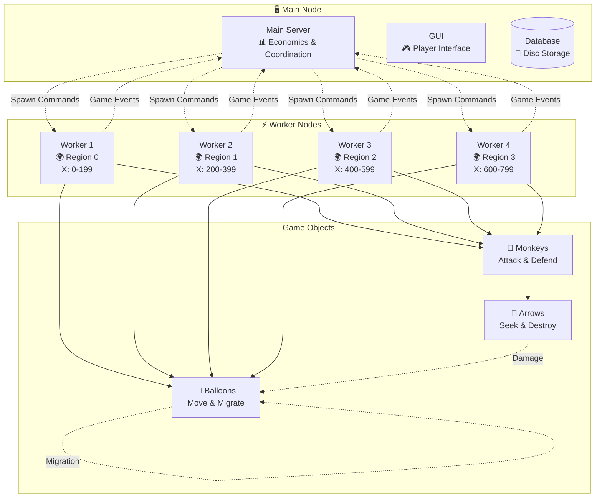

# BTD-Erlang Distributed Game Architecture

## Main Architecture Diagram

```mermaid
graph TB
    %% ===== PHYSICAL ARCHITECTURE =====
    subgraph "Main Node (132.72.81.60)"
        MainApp[Application<br/>main_supervisor]
        MainSuper[Main Supervisor]
        MainServer[Main Server<br/>gen_server]
        GUI[GUI<br/>wxErlang]
        MnesiaMain[(Mnesia Database<br/>Disc Copies)]
        
        MainApp --> MainSuper
        MainSuper --> MainServer
        MainServer <--> GUI
        MainServer <--> MnesiaMain
    end
    
    subgraph "Worker Node 1 (132.72.81.167)"
        Worker1Sup[Worker Supervisor<br/>Region 0]
        Region1[Region Server 0<br/>gen_server]
        MnesiaW1[(Mnesia<br/>RAM Copy)]
        
        Worker1Sup --> Region1
        Region1 <--> MnesiaW1
    end
    
    subgraph "Worker Node 2 (132.72.81.85)"
        Worker2Sup[Worker Supervisor<br/>Region 1]
        Region2[Region Server 1<br/>gen_server]
        MnesiaW2[(Mnesia<br/>RAM Copy)]
        
        Worker2Sup --> Region2
        Region2 <--> MnesiaW2
    end
    
    subgraph "Worker Node 3 (132.72.80.185)"
        Worker3Sup[Worker Supervisor<br/>Region 2]
        Region3[Region Server 2<br/>gen_server]
        MnesiaW3[(Mnesia<br/>RAM Copy)]
        
        Worker3Sup --> Region3
        Region3 <--> MnesiaW3
    end
    
    subgraph "Worker Node 4 (132.72.81.224)"
        Worker4Sup[Worker Supervisor<br/>Region 3]
        Region4[Region Server 3<br/>gen_server]
        MnesiaW4[(Mnesia<br/>RAM Copy)]
        
        Worker4Sup --> Region4
        Region4 <--> MnesiaW4
    end
    
    %% ===== GAME OBJECTS (Dynamic Processes) =====
    subgraph "Game Objects (Spawned Dynamically)"
        subgraph "Region 0 Objects"
            Bloon1[Bloon FSM<br/>gen_statem]
            Monkey1[Monkey FSM<br/>gen_statem]
            Arrow1[Arrow FSM<br/>gen_statem]
        end
        
        subgraph "Region 1 Objects"
            Bloon2[Bloon FSM<br/>gen_statem]
            Monkey2[Monkey FSM<br/>gen_statem]
            Arrow2[Arrow FSM<br/>gen_statem]
        end
        
        subgraph "Region 2 Objects"
            Bloon3[Bloon FSM<br/>gen_statem]
            Monkey3[Monkey FSM<br/>gen_statem]
            Arrow3[Arrow FSM<br/>gen_statem]
        end
        
        subgraph "Region 3 Objects"
            Bloon4[Bloon FSM<br/>gen_statem]
            Monkey4[Monkey FSM<br/>gen_statem]
            Arrow4[Arrow FSM<br/>gen_statem]
        end
    end
    
    %% ===== CONNECTIONS =====
    %% Main Server to Regions
    MainServer -.->|"Spawn Commands<br/>Cost Validation"| Region1
    MainServer -.->|"Spawn Commands<br/>Cost Validation"| Region2
    MainServer -.->|"Spawn Commands<br/>Cost Validation"| Region3
    MainServer -.->|"Spawn Commands<br/>Cost Validation"| Region4
    
    %% Regions to Main Server
    Region1 -.->|"Game Over<br/>Banana Rewards"| MainServer
    Region2 -.->|"Game Over<br/>Banana Rewards"| MainServer
    Region3 -.->|"Game Over<br/>Banana Rewards"| MainServer
    Region4 -.->|"Game Over<br/>Banana Rewards"| MainServer
    
    %% Regions spawn game objects
    Region1 --> Bloon1
    Region1 --> Monkey1
    Region1 --> Arrow1
    
    Region2 --> Bloon2
    Region2 --> Monkey2
    Region2 --> Arrow2
    
    Region3 --> Bloon3
    Region3 --> Monkey3
    Region3 --> Arrow3
    
    Region4 --> Bloon4
    Region4 --> Monkey4
    Region4 --> Arrow4
    
    %% Game Object Interactions
    Monkey1 -.->|"Target Finding"| Bloon1
    Monkey1 -.->|"Spawn Arrow"| Arrow1
    Arrow1 -.->|"Hit Damage"| Bloon1
    
    Monkey2 -.->|"Target Finding"| Bloon2
    Monkey2 -.->|"Spawn Arrow"| Arrow2
    Arrow2 -.->|"Hit Damage"| Bloon2
    
    Monkey3 -.->|"Target Finding"| Bloon3
    Monkey3 -.->|"Spawn Arrow"| Arrow3
    Arrow3 -.->|"Hit Damage"| Bloon3
    
    Monkey4 -.->|"Target Finding"| Bloon4
    Monkey4 -.->|"Spawn Arrow"| Arrow4
    Arrow4 -.->|"Hit Damage"| Bloon4
    
    %% Balloon Migration (Cross-Region)
    Bloon1 -.->|"Migration"| Bloon2
    Bloon2 -.->|"Migration"| Bloon3
    Bloon3 -.->|"Migration"| Bloon4
    
    %% Mnesia Replication
    MnesiaMain <==>|"Replication"| MnesiaW1
    MnesiaMain <==>|"Replication"| MnesiaW2
    MnesiaMain <==>|"Replication"| MnesiaW3
    MnesiaMain <==>|"Replication"| MnesiaW4
    
    %% Global Registry
    subgraph "Global Services"
        GlobalReg[Global Registry<br/>Process Discovery]
    end
    
    MainServer <--> GlobalReg
    Region1 <--> GlobalReg
    Region2 <--> GlobalReg
    Region3 <--> GlobalReg
    Region4 <--> GlobalReg
    Bloon1 <--> GlobalReg
    Bloon2 <--> GlobalReg
    Bloon3 <--> GlobalReg
    Bloon4 <--> GlobalReg
    
    %% Styling
    classDef supervisor fill:#ffeb3b,stroke:#333,stroke-width:2px
    classDef server fill:#4caf50,stroke:#333,stroke-width:2px
    classDef fsm fill:#2196f3,stroke:#333,stroke-width:2px
    classDef gui fill:#ff9800,stroke:#333,stroke-width:2px
    classDef database fill:#9c27b0,stroke:#333,stroke-width:2px
    classDef service fill:#607d8b,stroke:#333,stroke-width:2px
    
    class MainApp,MainSuper,Worker1Sup,Worker2Sup,Worker3Sup,Worker4Sup supervisor
    class MainServer,Region1,Region2,Region3,Region4 server
    class Bloon1,Bloon2,Bloon3,Bloon4,Monkey1,Monkey2,Monkey3,Monkey4,Arrow1,Arrow2,Arrow3,Arrow4 fsm
    class GUI gui
    class MnesiaMain,MnesiaW1,MnesiaW2,MnesiaW3,MnesiaW4 database
    class GlobalReg service
```

## Simplified Network View

```mermaid
graph TB
    subgraph "🖥️ Main Node"
        MS[Main Server<br/>📊 Economics & Coordination]
        GUI[GUI<br/>🎮 Player Interface]
        DB[(Database<br/>💾 Disc Storage)]
    end
    
    subgraph "⚡ Worker Nodes"
        W1[Worker 1<br/>🌍 Region 0<br/>X: 0-199]
        W2[Worker 2<br/>🌍 Region 1<br/>X: 200-399]
        W3[Worker 3<br/>🌍 Region 2<br/>X: 400-599]
        W4[Worker 4<br/>🌍 Region 3<br/>X: 600-799]
    end
    
    subgraph "🎯 Game Objects"
        B[🎈 Balloons<br/>Move & Migrate]
        M[🐒 Monkeys<br/>Attack & Defend]
        A[🏹 Arrows<br/>Seek & Destroy]
    end
    
    MS -.->|Spawn Commands| W1
    MS -.->|Spawn Commands| W2
    MS -.->|Spawn Commands| W3
    MS -.->|Spawn Commands| W4
    
    W1 -.->|Game Events| MS
    W2 -.->|Game Events| MS
    W3 -.->|Game Events| MS
    W4 -.->|Game Events| MS
    
    W1 --> B
    W2 --> B
    W3 --> B
    W4 --> B
    
    W1 --> M
    W2 --> M
    W3 --> M
    W4 --> M
    
    M --> A
    A -.->|Damage| B
    B -.->|Migration| B
```
